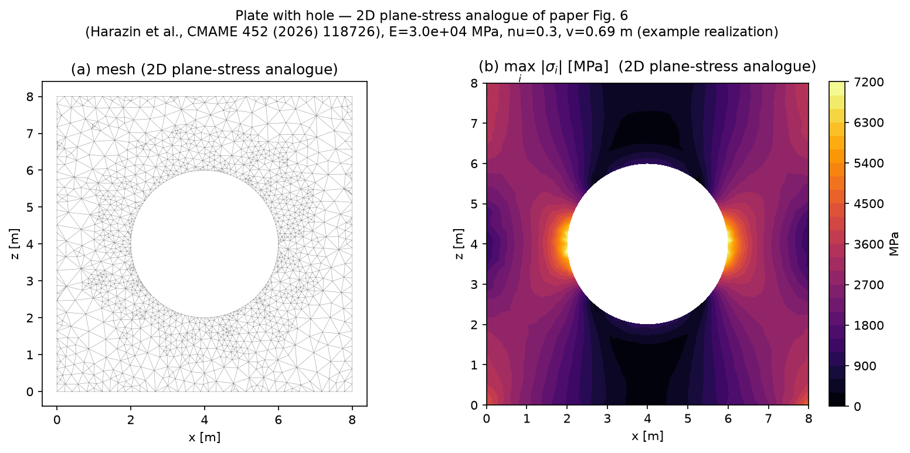
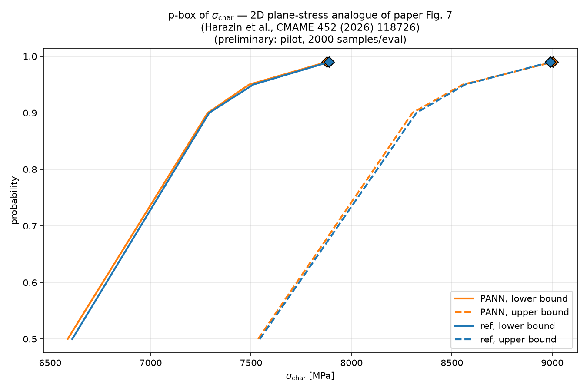
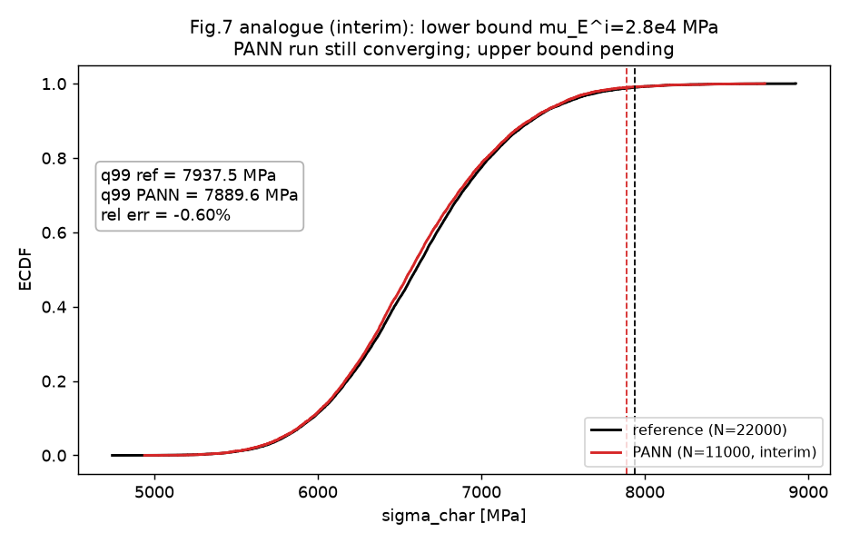

# RVE-based Multiscale Polymorphic UQ with PANN — YADE Reproduction

Reproduction of the method from:

> F. Harazin, J. Platen, F.N. Schietzold, W. Graf, M. Kaliske,
> "Multiscale polymorphic uncertainty quantification based on physics-augmented neural networks",
> *Comput. Methods Appl. Mech. Engrg.* 452 (2026) 118726.
> doi:10.1016/j.cma.2025.118726

## Method being reproduced (paper, §4–§5)

1. **Numerical homogenization (§2.4):** RVE with **periodic boundary conditions**
   (Hill–Mandel condition), macroscopic quantities as volume averages.
2. **PANN surrogate (§2.5, §4.2.1):** strain energy density
   Ψ(**I**(**C**(**F**)), **u**) approximated by a physics-augmented neural network,
   where **I** = invariants of the right Cauchy–Green tensor and **u** ∈ **U**
   are the uncertain RVE descriptors. Stress reconstructed by autodiff:
   **S** = 2∂Ψ/∂**C**; loss = ‖**S**ᴺᴺ − **S**ᴿⱽᴱ‖².
3. **Domain-separated sampling (§4.2.2):** sample uncertain-parameter space **U**
   by LHS → generate + convergence-test one RVE per **u** sample → LHS in the
   mechanical space **F** per RVE. Convergence criterion: Δ = std(‖**S**‖)/mean(‖**S**‖) ≤ 0.5%.
4. **Polymorphic UQ (§3–§4):** aleatoric (Monte Carlo), epistemic (interval
   optimization), parametric p-boxes; confidence intervals for unbounded
   distributions (§4.2.3).
5. **Numerical examples (§5):** (I) plate with hole, parametrized Neo-Hookean
   (reference solution available); (II) full framework on concrete-like RVE
   with ellipsoidal inclusions, uncertain volume fraction *v*ᶠ (iprf) and matrix
   modulus *E*ₘₐₜᵣᵢₓ (rf).

## Adaptation to YADE (this repo)

The paper's mesoscale solver is FEM (tetrahedral mesh, hyperelastic continuum).
Here the RVE is realized with **YADE DEM** (periodic `Cell`, prescribed
deformation gradient paths, homogenized stress via `getStress()`), keeping the
paper's workflow intact:

- periodic BCs → Hill–Mandel (§2.4, Eq. 9–10)
- RVE convergence study over realizations (§4.1)
- domain-separated LHS (§4.2.2)
- PANN surrogate Ψ(**I**, **u**) with stress via autodiff (§4.2.1)
- MC / interval / p-box UQ (§3)

DEM packings were explored as the mesostructure; the DEM energy-PANN route is
documented as a negative result (Phase 0 gates failed, see Status).
The surrogate/UQ layers are implemented against the analytical reference.

## Layout

```
rve/          RVE generation (packings), periodic homogenization, convergence test
sampling/     LHS, domain-separated U × F sampling scheme
surrogate/    PANN: Ψ(I,u) network, stress/tangent via autodiff
uq/           aleatoric (MC), epistemic (interval), p-box evaluation
examples/     ex1_neohooke/ — Example-I analog (surrogate vs analytical reference)
docs/         method notes extracted from the paper
data/         generated RVE datasets (not versioned if large)
```

## Requirements

- `yadedaily` (YADE daily build, Ubuntu 24.04) — `yadedaily` on PATH
- Python 3.12, `numpy`, `scipy`; `torch` for the PANN surrogate

## Quick start

```bash
# 1. RVE gate tests (paper §4.1): G1a/G1b mapping checks are fast;
#    full G1c/G2 DEM gates take a while (1000-particle packings)
yadedaily -x rve/tests/test_gates.py
# 2. Domain-separated sampling demo (paper §4.2.2, Fig. 4)
yadedaily -x sampling/domain_separation.py
# 3. PANN training (paper §4.2.1; full 2000-epoch run)
~/workspace/venvs/rve-pann/bin/python surrogate/train_pann.py
# 4. Material-point UQ demo (paper §3–§4 method chain)
~/workspace/venvs/rve-pann/bin/python uq/material_uq.py
# 5. Macro BVP + UQ (Example I, Fig. 6/7 analogues) — macro/, see for_manager/T08
```

## Results

**Fig. 6 analogue** — plate with hole (8×8 m, r = 2 m), principal stress field
for an exemplary realization (2D plane-stress analogue of the paper's 3D FEAP model):



**Fig. 7 analogue (pilot)** — p-box of σ_char, PANN-based vs reference solution;
q99 relative errors −0.15% / +0.13% (paper: 0.1% / 0.07%):



**Fig. 7 analogue (full run, interim)** — lower bound (μ_E^i = 2.8e4 MPa):
ECDF of σ_char, reference (N=22000, converged) vs PANN (N=11000, still converging);
q99 = 7937.53 vs 7889.63 MPa, rel. err −0.60%:



### Key numbers

| Quantity | Paper | This repo | Status |
|---|---|---|---|
| T04b test stress rel. L2 | <5% (DOD) | 0.4516% | ✅ |
| T05 material-point q99 rel. err | — | 0.5513% | ✅ |
| Fig. 7 pilot q99 rel. err (2 bounds) | 0.1% / 0.07% | −0.15% / +0.13% | ✅ |
| Fig. 7 full run, lower bound q99 | — | −0.60% (interim) | 🔄 converging |

### Table 1 — Example I DoE bounds (reproduced value-by-value)

| Parameter | Paper | This repo | Match |
|---|---|---|---|
| E_iprf [MPa] | [2.5e4, 3.5e4] | [2.5e4, 3.5e4] | ✅ |
| ν_rf | [0.21, 0.39] | [0.21, 0.39] | ✅ |
| U samples × F per U | 50 × 100 | 50 × 100 | ✅ |

### Table 2 — Example I PANN architecture (reproduced value-by-value)

| Layer | Paper | This repo | Match |
|---|---|---|---|
| Input | 5, softplus | 5, softplus | ✅ |
| Hidden 1 | 175, softplus | 175, softplus | ✅ |
| Hidden 2 | 175, softplus | 175, softplus | ✅ |
| Output | 1, linear | 1, linear | ✅ |

## Status (2026-10-06)

**Phase 1A — analytical track: complete.** Exact Eq.(33) implementation
(S=2∂Ψ/∂C err 1.4e-08); PANN 5→175→175→1, test stress rel. L2 = 0.45%;
material-point UQ demo (MC q99 err 0.55%, interval bounds <1.2%).

**Phase 0 — DEM track: closed as negative result.** FrictMat and bonded
CohFrictMat both fail the hyperelastic gate G1c (dissipation 25%/16% > 10%;
representativeness Δ=4.9%/3.6% > 0.5%) — finite-strain contact-topology
hysteresis is intrinsic to DEM. Evidence: `docs/method_notes.md`.

**Phase 1B — macro BVP (Example I) reproduction: pilot complete, full run underway.**
2D plane-stress plate-with-hole solver + KL random fields done.
Macro UQ pilot: PANN vs reference q99 rel. err −0.15%/−0.043%/+0.13%
(paper: 0.1%/0.07%), p-boxes nearly overlapping, q99 monotonic in μ_E^i
(optima at interval bounds, as in the paper).
Full run (paper MC rule: 1e4 + 2e3 redraws until q99 stable <0.5% over 5 steps):
run 1/4 done — μ=2.8e4 reference, N=22000, q99=7937.53 MPa, 0 failures.
run 2/4 running — μ=2.8e4 PANN, N=11000, q99=7889.63 MPa
(−0.60% vs reference, within the 2% gate; converging further).

Figure/table ledger: `docs/figure_table_inventory.md`.
Reproduction plan (v2, current): `docs/reproduction_plan_review_2026-10-05.md`.
